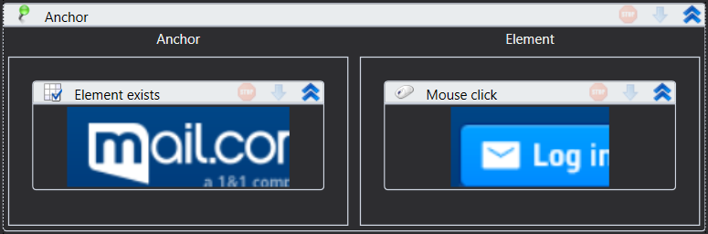

# Anchor

.png>)

Element that operates with element based on its position relative to element-anchor.

Properties

&#x20;\- Position\*: \[LTools.WebBrowser.Model.AnchorPosition] Element location relative to the anchor

You can use the Element exists as an anchor
