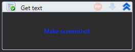

# Get text

.png>)

Element that obtains the text of a selected control element. The component works correctly only inside the SAP container.



Properties

&#x20;\- Element ID: \[String] ID of an element

&#x20;\- Element: \[LTools.SAP.Model.SAPUIItem] Reference to a control element

&#x20;\- Variable\*: \[String] Variable for storing obtained text

&#x20;\- Timeout\*: \[Int32] Maximum waiting time for process completion (ms)

```
C#
LTools.SAP.SapApp app = LTools.SAP.SapApp.Init(wf);
string txt = app.GetText("/app/con[0]/ses[0]/wnd[0]/usr/cntlIMAGE_CONTAINER/shellcont/shell/shellcont[0]/shell");

Python
app = LTools.SAP.SapApp.Init(wf)
txt = app.GetText("/app/con[0]/ses[0]/wnd[0]/usr/cntlIMAGE_CONTAINER/shellcont/shell/shellcont[0]/shell")

JavaScript
var app = _lib.LTools.SAP.SapApp.Init(wf);
var txt = app.GetText("/app/con[0]/ses[0]/wnd[0]/usr/cntlIMAGE_CONTAINER/shellcont/shell/shellcont[0]/shell");
```
