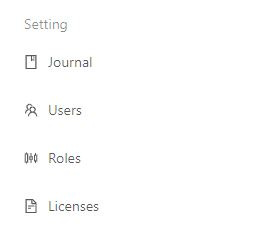

# Setting

Orchestrator provides the ability to administer:

* robot action log,
* user accounts,
* user roles,
* licenses.

Object administration is available in the tab on the left under the appropriate heading:

