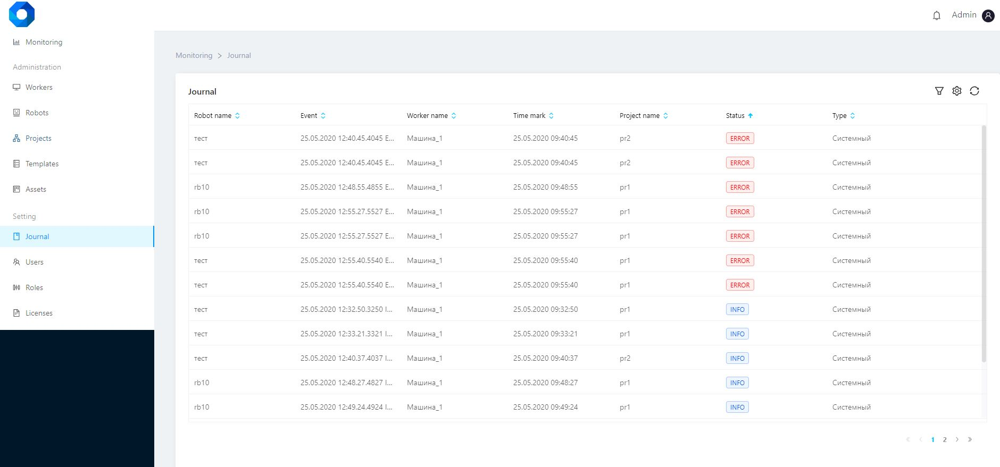
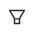
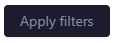
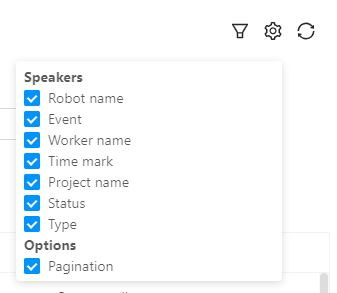

# Journal

The "Journal" tab provides information about the current robots activity.

The Log includes information about:

* the robots name,
* events committed by robots,
* the machines name on which the robots are installed,
* the robots actions execution time,
* the projects running robots,
* the robot statuses,
* the robot types.


**Working with the robot actions list**

The robot actions list can be sorted by each column by clicking on the icon  .

It is possible to search for the robots' actions. Clicking on the icon  will open a window for searching the robots' actions in the log.

To search, you need to set filters (status, execution time, type) and click on the "Apply filters"  button.


To reset filters, click on the "Reset Filters"  button.

It is also possible to customize a column set at the user's discretion.&#x20;

To do this, you need to click on the icon  next to the search bar and check the required columns.

The robot actions list can be updated by clicking on the icon  located next to the search string.
