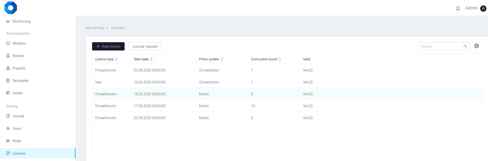

# Licenses

The "Licenses" tab provides information on licenses.

The "Licenses" tab includes the following information:

* validity period,
* registration date,
* the product that owns the license,
* state.

**Working with the licenses list**

The licenses list can be sorted by each column by clicking on the icon  .

The license can be found in the list using the search string on the right.

It is also possible to configure the columns display at the user discretion (administrator). To do this, click on the icon next  to the search string and select the desired columns.


**Adding a license**

To add a license, click on the button  , after which a window for adding will open. In the "File" field, you must load the license file and save the data.


**License request**

To create a license request, click on the button  , after which a window for the request will open. You must fill in the fields and save the entered data:

* registration date,
* period (specify the requested license validity period, select a value from the list),
* product (specify the product for which the license is requested, select a value from the list),
* specify the requested licenses number.

