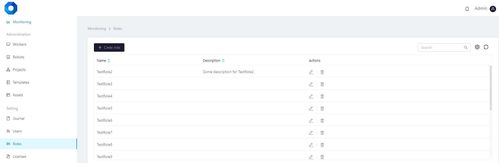

# Roles

The "Roles" tab provides information about the roles assigned to users.

The "Roles" tab includes the following information:

* role name,
* role description,
* date created,
* who created the role, etc.


&#x20;**Working with the users' list**

The roles list can be sorted by each column by clicking on the icon  .

The user can be found in the list using the search string on the right.

It is also possible to configure the columns display at the user discretion (administrator). To do this, click on the icon  next to the search string and select the desired columns.

The roles list can be updated by clicking on the icon  located next to the search string.


**Role creating**

To create a role, click on the button  , after which a window for entering data will open. To create a role, you must fill in the fields and save the entered data. The created role will appear in the roles general list.

**SCREENSHOT**


**Role management**

If necessary, the roles can be managed - edited or deleted.&#x20;

These actions are available by clicking the corresponding icons in the "Actions" column.

&#x20;&#x20;

