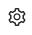
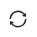
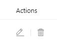

# Users

The "Users" tab provides information about user accounts.

The "Users" tab includes information about:

* user logins,
* users name,
* Email users.


&#x20;**Working with the users' list**

The users' list can be sorted by each column by clicking on the icon .

The user can be found in the list using the search string on the right.

It is also possible to configure the columns display at the user discretion (administrator). To do this, click on the icon  next to the search string and select the desired columns.

The users' list can be updated by clicking on the icon  located next to the search string.

**Creating a user**

To create a user, click on the button  , after which a window for entering data will open. To create a user, you must fill in the fields and save the entered data. The created user will appear in the users' general list.

**Managing user accounts**


If necessary, user accounts can be managed - edited or deleted.

These actions are available by clicking the corresponding icons in the "Actions" column.

