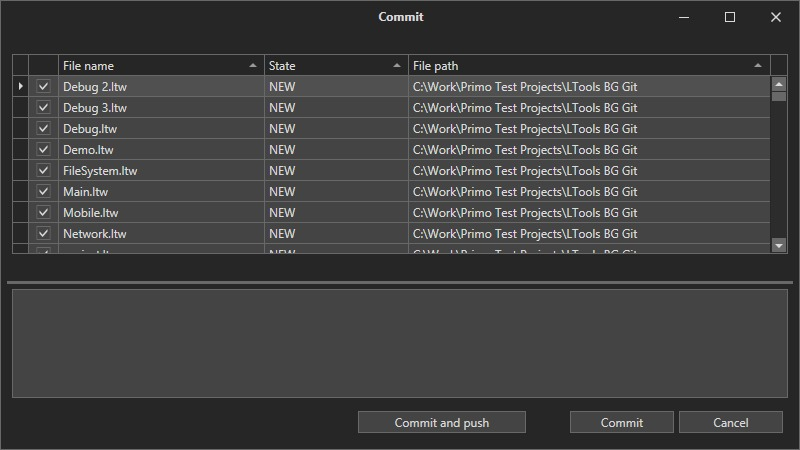
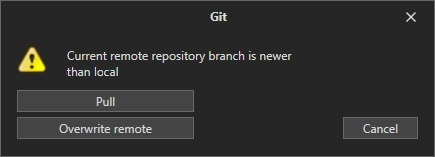
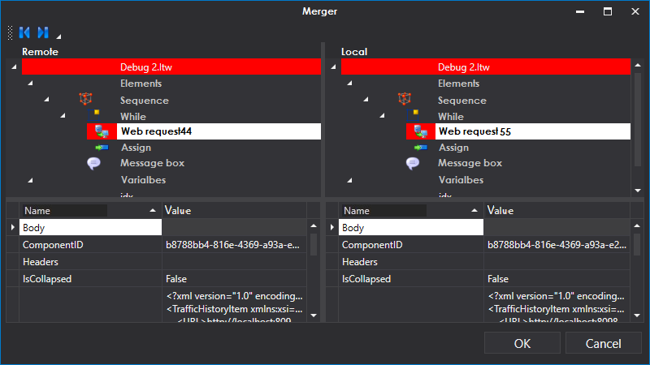
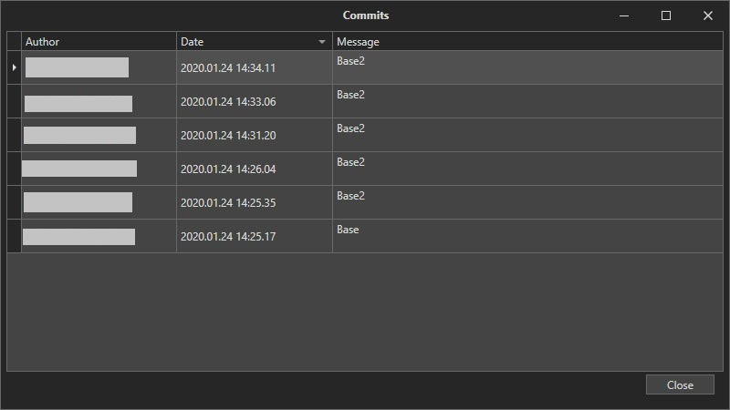
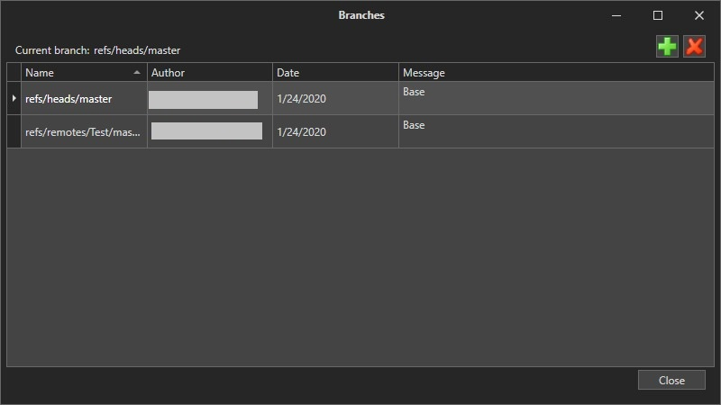

# Release control

To manage the storage of code versions the system has integration with the Git storage . To manage integration use Project -> Git menu.

To save versiom in Git local storage use Commit menu.

"Commit" button opens the dialog of the Git local storage selection. "Commit and push" button displays a dialog for selecting remote Git storage (Git, GitHub, TFS, etc.).

.jpg>)

"Use credentials" menu uses credentials of the current operating system user.&#x20;

**Attention! To work with Azure storage, alternative authorization method must be enabled.**&#x20;

In case of conflicts a dialog will be displayed to select options for resolving them.&#x20;

If you select "Overwrite remote", the version of the remote repository will be replaced with the local version. When you select "Pull" , Git tries to merge the remote and local versions. If there are some unsolvable conflicts the merge changes dialog will be displayed, in this dialog you need to determine which versions (local or remote) will be further used.

To select a version, select the process being processed and click Remote or Local at the top of the window. After resolving all conflicts you can press the OK button . When all operations are completed , the project must be Commit and push again.

To get the last changes from Remote repository use "Pull" button in Project-Git menu. Versions will be merged according to the same rules as in Commit menu.

To cancel all changes made until the last Commit, click the "Undo pending changes" button in the Git menu.

In order to compare local version with repository version you should right-click the file in Project tree and choose Show changes menu.

.png>)

"View commits" button is used to roll back to the specified version. To roll back you should select the version, right-click on it and select "Use".&#x20;

"Branches" button in Git menu is used to manage repository branches. To create the branch press the  button. To delete the branch select it and press the  button.  To manage branch states select the branch you need , right-click on it, and select Checkout, Rebase or Merge from the menu.&#x20;

"Disconnect" button in Git menu deletes the Local repository and disconnects the Remote repository.
