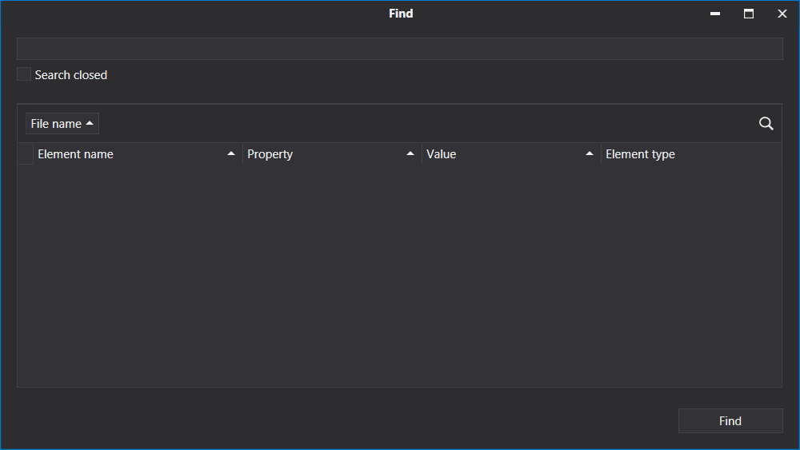

# Search

To search in the project, click the Find  button or press Ctrl+C, and the Find window will be displayed

To search in closed sequences and workflows select the "Search closed" checkbox . To open the found element , double-click one in the table.
