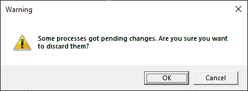

# Working with sequences

All the elements of a process sequence are divided into two categories:

* standard elements
* containers

A new process sequence consists of one clean container.

.png>)

At its core, a process sequence can have only one Sequence container, which will contain the entire logic of a script.

To add an element to the container, drag the element to be added from the Elements panel to the container triangle symbol, and a yellow frame will appear around the triangle.

.png>)

In a similar way, new containers and elements are added and elements are added to new containers.

.png>)

There are two options for moving elements within a process

1. Drag and drop. It is necessary to grab the header of an element with the mouse and move it to the desired triangle, after which a yellow frame should appear around the triangle.

.png>)

1. Select the necessary element by clicking on it with the mouse or select several elements by pressing the Ctrl key. Once the selection is complete, you should either click the "Copy" button or the "Cut" button in the Edit menu or the similar Actions Panel buttons .png>).png>), or the Ctrl+C, CTRL+X key combination, respectively. In order to move an element, you should select it and click the Edit menu or the similar Actions Panel button .png>) , or the Ctrl+V key combination.

In order to cancel the last change, you should click the Cancel the Edit menu or the similar button of the Actions Panel .png>), or the Ctrl-Z key combination.

To return to the last cancelled action you should press the Repeat button of the Edit menu or the similar button of the Action Panel.png>), or the Ctrl-Y key combination.

The symbol  .png>)   indicates that there are errors in the element. When you hover over the icon,  a hint about the error will appear.

In case of changes in the process, a symbol \* will appear in the title of the process bookmark.

When trying to close the bookmark of a modified process, the corresponding message will be displayed.

If an item takes up too much space, it can be minimized by pressing the "Minimize" button of that element .png>). To maximize the element back, press the "Maximize" button .png>).

To delete an element, you should select it with the mouse or select a group of elements by pressing the Ctrl key and then press the Del key.

There is a special control element for zooming the process display.

