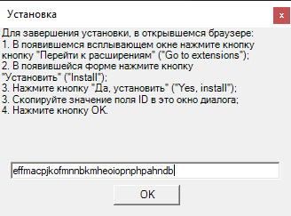

# Opera (Deprecated)

To install Opera browser extension:&#x20;

* Click the Opera icon in Primo in the Settings - Tools - Extensions menu&#x20;
* Opera window will be opened and notification about extension is deactivated will appear

* Press Go to Extensions button

.png>)

* Copy the ID field&#x20;

* Press Instal button

* Press Yes, instal button

* Paste ID from buffer and press OK

* Extension will be installed. To use the extension press OK

