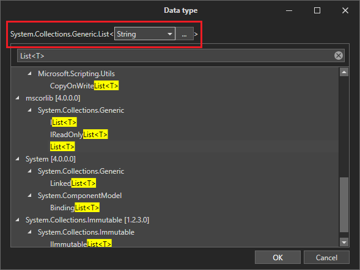

# Variables and arguments

There are variables in the work of the scripts for storing intermediate data. There is the Variable panel for managing variables.

.png>)

A variable consists of the following parts:

* Variable name is set according to rules of selected language (C#, Python или JavaScript)&#x20;
* Variable type is a variable data type in selected language
* Comment is a text describing the purpose of a variable (optional)
* Default value is an expression in selected language executed when creating a variable, the result of which will be assigned to the variable at creation (optional)

If you do not specify the default value for a variable, the initial value of the variable will be NULL.

To create a new variable, press the "Create a Variable" button .png>) and enter information about the variable in the window that appears.

.png>)

For a more convenient selection of a variable type, you can press the "..." button and find the desired one in the Data Types window.

.png>)

There is a generalized type selection assistant necessary for working with generalized types in the Data Type window.

To delete a variable, you should select a line with it in the table and either click the "Delete the Variable" button , or press the Delete button.

To edit a variable, double-click on the line, the value of which should be changed.

The type of a variable is an autocomplete value, for example, just type List \<String> and press Enter, and the system itself will bring the type to System. Collections.Generic.List\<System.String>.

Arguments are variables intended for exchange between processes. The difference from a normal variable is the presence of the Direction property, which determines whether an argument can receive and transmit data to the calling process. The property Direction has the following values:

IN – The argument works only for receipt

OUT – The argument works only for transmission

IN\_OUT – Both-way argument

.png>)

To call a process from another process, you need to drag the called process from the Project panel to the triangle that defines the place of the subprocess call in the script.

.png>)

To connect to the arguments of the subprocess, you should press .png>) button. In the Assignment column of the opened window you should specify expressions in selected language (C#, Python or JavaScript) or the names of the variables used in the interaction with the subprocess. Once you have finished editing, you can close the window.

.png>)
